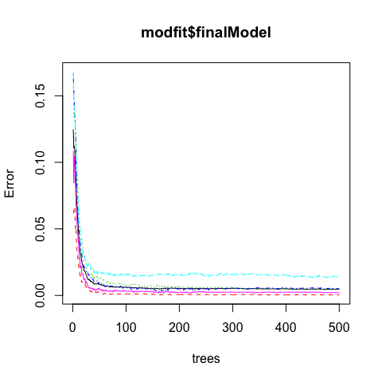

# Practical Machine Learning: Project Report


***
## Summary

In this report, I analyze a provided dataset collected from accelerometers on the belt, forearm, arm, and dumbell of 6 individuals. I build a model using a machine learning algorithm called "Random Forest", and use this model to predict the manners or types of weight lifting exercises with 99.2% accuracy.  This model should help identify the mistakes made in weight-lifting exercises.    

## Data

The training data for this project are available [here](https://d396qusza40orc.cloudfront.net/predmachlearn/pml-training.csv).  The test data are available [here](https://d396qusza40orc.cloudfront.net/predmachlearn/pml-testing.csv).

The data for this project come from this source:[http://groupware.les.inf.puc-rio.br/har](http://groupware.les.inf.puc-rio.br/har). 

## Exploratory data analysis 

First look at the structure of the raw training dataset. It has 160 variables and 19622 observations. The outcome variable classe representing different weight-lifting behaviours should be catagorical. Therefore, I change it to the factor type.


```r
raw_training <- read.csv("pml-training.csv", header = TRUE, stringsAsFactors=FALSE)
str(raw_training, list.len=10)
```

```
## 'data.frame':	19622 obs. of  160 variables:
##  $ X                       : int  1 2 3 4 5 6 7 8 9 10 ...
##  $ user_name               : chr  "carlitos" "carlitos" "carlitos" "carlitos" ...
##  $ raw_timestamp_part_1    : int  1323084231 1323084231 1323084231 1323084232 1323084232 1323084232 1323084232 1323084232 1323084232 1323084232 ...
##  $ raw_timestamp_part_2    : int  788290 808298 820366 120339 196328 304277 368296 440390 484323 484434 ...
##  $ cvtd_timestamp          : chr  "05/12/2011 11:23" "05/12/2011 11:23" "05/12/2011 11:23" "05/12/2011 11:23" ...
##  $ new_window              : chr  "no" "no" "no" "no" ...
##  $ num_window              : int  11 11 11 12 12 12 12 12 12 12 ...
##  $ roll_belt               : num  1.41 1.41 1.42 1.48 1.48 1.45 1.42 1.42 1.43 1.45 ...
##  $ pitch_belt              : num  8.07 8.07 8.07 8.05 8.07 8.06 8.09 8.13 8.16 8.17 ...
##  $ yaw_belt                : num  -94.4 -94.4 -94.4 -94.4 -94.4 -94.4 -94.4 -94.4 -94.4 -94.4 ...
##   [list output truncated]
```

```r
raw_training$classe <- as.factor(raw_training$classe)
```
By looking at the dataset, there are a number of possible predictors that have a lot of NAs or empty strings ("").  They are eliminated from the dataset.  


```r
raw_training <- raw_training[, !(colSums(is.na(raw_training)) > 0)]
raw_training <- raw_training[, !apply(raw_training, 2, function(x) any(x==""))]
```

After careful inspection of all the columns, it seems that the first 7 variables (X, user_name, raw_timestamp_part_1, "raw_timestamp_part_2, cvtd_timestamp, new_window, num_window) are not useful in any way for predicting the weight-lifting behaviors.  So, they are eliminated from the dataset. 


```r
raw_training <- raw_training[,-(1:7)]
```

## Model Building

### Spitting data to training and cross-validation sets
Since the dataset has quite a lot of observations, it would be appropiate to split it to two datasets, one for training the model and the other for cross validation. 


```r
library(caret)
set.seed(12345)
inTrain <- createDataPartition(raw_training$classe, p=0.8, list=FALSE)
training <- raw_training[inTrain,]
cross_validation <- raw_training[-inTrain,]
```

### Fitting the Model

To identify the weight-lifting behaviors based on the training data is a typical classification problem.  The first machine learning method coming to my mind is "Random Forest", which is generally accurate, but may suffer overfitting problem.  Next I will fit a prediction model using this method.  


```r
modfit <- train(classe ~., data=training, method="rf", tuneGrid = data.frame(mtry = 3))
```

### Cross Validation and Error Estimation
  
* Error estimation of the model (in sample error) is shown in the following model diagnostic plot.


```r
plot(modfit$finalModel)
```

 

* Then the model is applied to the cross validation dataset. The confusion matrix between prediction and truth would estimate the out of sample errors. 


```r
confusionMatrix(cross_validation$classe, predict(modfit, cross_validation))
```

```
## Confusion Matrix and Statistics
## 
##           Reference
## Prediction    A    B    C    D    E
##          A 1116    0    0    0    0
##          B    4  754    1    0    0
##          C    0   11  673    0    0
##          D    0    0   13  630    0
##          E    0    0    0    2  719
## 
## Overall Statistics
##                                           
##                Accuracy : 0.9921          
##                  95% CI : (0.9888, 0.9946)
##     No Information Rate : 0.2855          
##     P-Value [Acc > NIR] : < 2.2e-16       
##                                           
##                   Kappa : 0.99            
##  Mcnemar's Test P-Value : NA              
## 
## Statistics by Class:
## 
##                      Class: A Class: B Class: C Class: D Class: E
## Sensitivity            0.9964   0.9856   0.9796   0.9968   1.0000
## Specificity            1.0000   0.9984   0.9966   0.9960   0.9994
## Pos Pred Value         1.0000   0.9934   0.9839   0.9798   0.9972
## Neg Pred Value         0.9986   0.9965   0.9957   0.9994   1.0000
## Prevalence             0.2855   0.1950   0.1751   0.1611   0.1833
## Detection Rate         0.2845   0.1922   0.1716   0.1606   0.1833
## Detection Prevalence   0.2845   0.1935   0.1744   0.1639   0.1838
## Balanced Accuracy      0.9982   0.9920   0.9881   0.9964   0.9997
```

* Clearly, this model has done a good job and achieved predicting accuracy of 99.2% on the cross-validation data set.

## Predictions

The model is applied to testing dataset, and the predictions are shown below.


```r
raw_testing <-read.csv("pml-testing.csv", header = TRUE, stringsAsFactors=FALSE)
predictors <- names(training[, -53])
testing <- raw_testing[, predictors] 
answers <- predict(modfit, testing)
answers
```

```
##  [1] B A B A A E D B A A B C B A E E A B B B
## Levels: A B C D E
```
